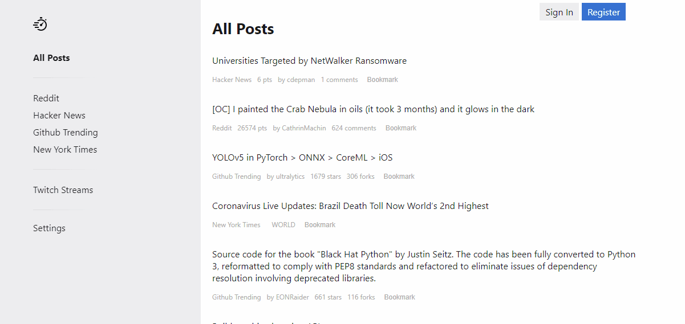
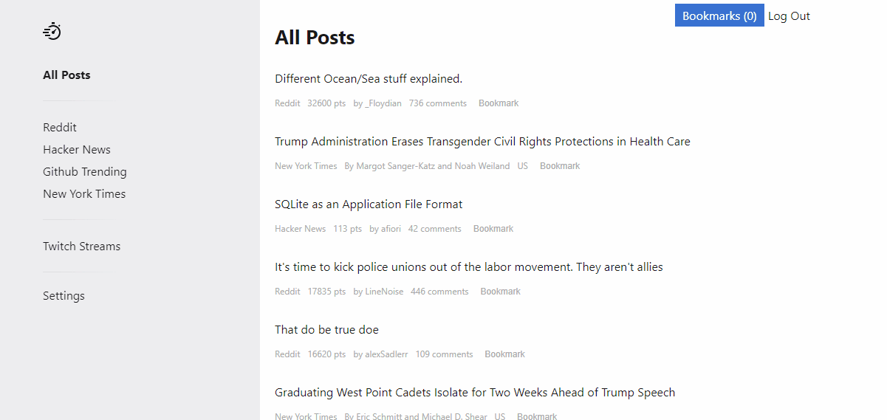

# Procrastinator App

> Procrastinator App is a webapp to browse and bookmark posts from various news and media sites.

---

## Table of Contents

- [Main Features](#features)
- [Tech Used](#tech-used)
- [Server](#server)
- [Installation](#installation)
- [License](#license)

---

## Features

### Browse Posts

### Bookmark Posts

---

## Tech Used

> Client / Frontend

- React
- HTML
- CSS

> Server / Backend

- Node
- Express
- Postgresql
- Bcrypt

> Deployment

- Heroku

---

## Server

https://github.com/zksmith/procrastinator-api

## Installation

-Clone the repo: `git clone https://github.com/zksmith/procrastinator-app.git`

-Install dependencies: `npm install`

In the project directory, you can run:

### `npm start`

Runs the app in the development mode. 
Open [http://localhost:3000](http://localhost:3000) to view it in the browser.

The page will reload if you make edits. 

---

## License

- **[MIT license](http://opensource.org/licenses/mit-license.php)**
- Copyright 2019 © <a href="http://zahiersmith.com" target="_blank">Zahier Smith</a>.
